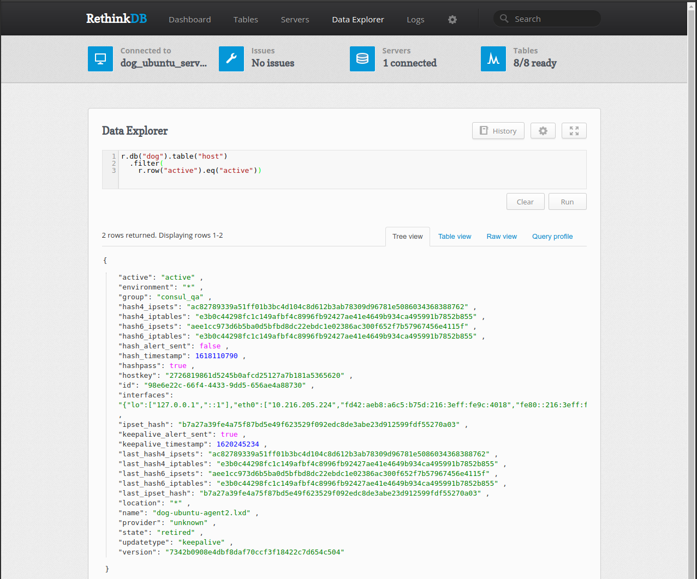
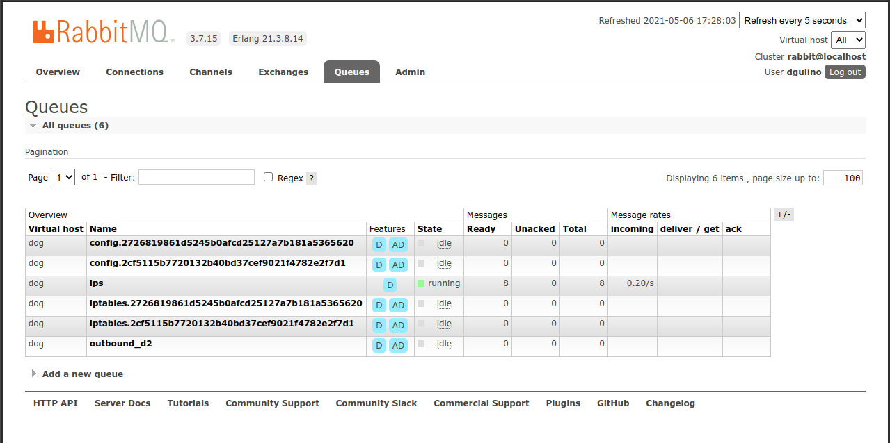

<p align="center">
  
</p>

# dog_trainer

dog_trainer is the central control server of dog.

Components:
- [dog_trainer](#dog_trainer) the Erlang application.
- [RethinkDB](#rethinkdb), a NoSQL database that store's dog's state.
- [RabbitMQ](#rabbitmq). All communication between dog_trainers and dog_agents goes through RabbitMQ queues.

# erlang application

dog_trainer is deployed as an Erlang release, which is a way to combine the application and all of the Erlang language
components needed.

## Start

`sudo systemctl start dog_trainer`

## Stop

`sudo systemctl stop dog_trainer`

## Log location

`/var/log/dog_trainer`

## Temp file location

`/tmp/dog_trainer`

## Useful shell commands

   [Commands](dog_trainer-shell.md)

## Configuration

   Configuration is stored in a file called sys.config, which is located in /opt/dog_trainer/releases/$VERSION/ 

  example sys.config annotated:

```bash
      [
    {dog_trainer, [
        {env, "q1"}, # name of this dog_trainer's environment, limited to two characters.  needs to be unique between any linked dog_trainers.
        {version, "20180423-180410-relflow"}, 
        {smtp_relay,"smtp.sendgrid.net"}, # email configuration for alerts
        {smtp_username, "" },
        {smtp_password, "" },
        {smtp_to, [""]}, # list of email recipients.
        {smtp_from,""},
        {polling_interval_seconds,60}, # how often 
        {keepalive_alert_seconds,1800}, # time a dog_agent can not communicate before being considered 'inactive'.
        {rethinkdb_host, "dog-db-qa.nocell.io"}, # rethinkdb config
        {rethinkdb_port, 28015},
        {smtp_password, "" },
        {rethinkdb_username, "" },
        {rethinkdb_password, "" },
        {rethink_timeout_ms, 10000},
        {rethink_squash_sec, 1.0}, # how many seconds to combine rethink streams before applying them.
        {profile_periodic_publish_interval_seconds, 5},  # how often to publish iptables updates, if they are queued.
        {ipset_periodic_publish_interval_seconds, 5}, # how often to publish global ipsets, if an update is queued.
        {check_v6_hashes, true}, # whether dog_agent IPv6 ipset hashes are checked by dog_trainer.
        {generate_unset_tables, false}, # whether to generate and publish naive (one IP per line) iptables in addition to iptables that use ipsets.
        {max_interval_since_last_agent_update,2}, # how many intervals to wait when no dog_agent updates are received before dog_trainer stops applying updates.
                                                  # this is done to ensure a dog_trainer that is having a network will not set all hosts as inactive or retired.
        {pools, [ # rethinkdb db pool configuration.
            {pool1, [
                {size, 10},
                {max_overflow, 20}
            ], []}
        ]}
    ]},
    {sync, [
        {growl, none},
        {log, [warnings, errors]},
        {non_descendants, fix},
        {executable, auto},
        {whitelisted_modules, []},
        {excluded_modules, []}
    ]},
    {lager, [
        {handlers, [
            {lager_file_backend, [{file, "/var/log/dog_trainer/error.log"}, {level, error}, {size, 104857600}]},
            {lager_file_backend, [{file, "/var/log/dog_trainer/console.log"}, {level, info}, {size, 104857600}]}
        ]},
        {crash_log, "/var/log/dog_trainer/crash.log"},
        {tracefiles, [
        	    ]},
        {async_threshold, 10000},
        {sieve_threshold, 5000},
        {sieve_window, 100}
    ]},
    {thumper, [ # thumper is the rabbitmq client library.  certificates should always be used.
        {substitution_rules, [{cluster, {edb, get_cluster_id, []}}]},
        {thumper_svrs, [default, publish]},
        {brokers, [
            {default, [
                {rabbitmq_config,
                    [
                        {host, "localhost"},
                        {port, 5673},
                        {api_port, 15672},
                        {virtual_host, <<"dog">>},
                        {user, "" },
                        {password, "" },
                        {ssl_options, [{cacertfile, "/var/consul/data/pki/certs/ca.crt"},
                                       {certfile, "/var/consul/data/pki/certs/server.crt"},
                                       {keyfile, "/var/consul/data/pki/private/server.key"},
                                       {verify, verify_peer},
                                       {server_name_indication, disable},
                                       {fail_if_no_peer_cert, true}
                                      ]},
                         {broker_config,
                             {thumper_tx,
                                 ["/opt/dog_trainer/priv/broker.tx"]}}
                    ]}]},
            {publish, [{rabbitmq_config, default}]}
        ]},
        {queuejournal, # local rabbitmq queueing
            [
                {enabled, true},
                {dir, "/var/db/dog_trainer/queuejournal"},
                {memqueue_max, 10000},
                {check_journal, true}
            ]
        }
    ]}
].
```

## Ports (tcp)

- dog_trainer:
  - 7070: API
  - 8085: imetrics
- rethinkdb:
  - 8080: admin console
  - 29105: intracluster
  - 28015: client driver connections
- rabbitmq:
  - 4369: epmd, a peer discovery service used by RabbitMQ nodes and CLI tools
  - 5673: AMQP with TLS
  - 15672: management UI

# imetrics

dog_trainer uses the imeterics library to expose metrics:

```bash
    $ curl http://localhost:8085/imetrics/varz/counters
ips_update keepalive:6
```

```bash
    $ curl http://localhost:8085/imetrics/varz/gauges
publish_queue_length 0
interval_since_last_agent_update 1
hash_failures hash4_iptables:0 hash6_iptables:0 hash4_ipsets:0 hash6_ipsets:0 ipset_hash:0
no_agent_updates_received 0
host_keepalive retirement:0 failure:0 recovery:0
```

## Erlang console

`/opt/dog/dog_trainer remote_console`

    Useful commands:
    - [observer_cli](https://github.com/zhongwencool/observer_cli):start()

# rethinkdb

RethinkDB is a NoSQL database used to store dog_trainer's state.\

dog_trainer not only queries and updates the db, it also extensively leverages RethinkDB's
[changefeeds](https://rethinkdb.com/docs/changefeeds/javascript/) to trigger events.\

You can use the RethinkDB data explorer to query the database.

## Useful DB queries: [DB Queries](dog_trainer-common_reql.md)



## console

http://$HOSTNAME:8080/

# rabbitmq

RabbitMQ is a message queue server.  All communication between dog_trainers and dog_agets goes through RabbitMQ.
This provides an easy way to monitor the communication status of each component.\

Each dog_agent creates one iptables.$HOSTKEY that it ingests data from dog_trainer.\

Each dog_agent also creates one config.$HOSTKEKEY\



One can disconnect an agent, forcing it to reconnect.  This can fix dog_agent connectivity issues.

## console

http://$HOSTNAME:15672/
